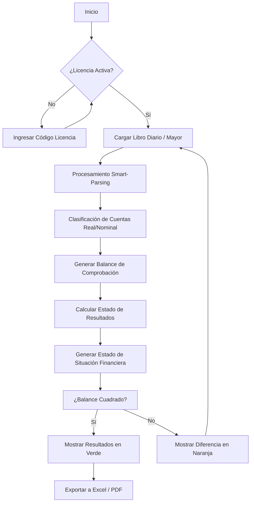

# 📊 Calculador de Balance General - Guía Informativa

## 🎯 ¿Qué es esta aplicación?

**Calculador de Balance General** es una herramienta diseñada para estudiantes y profesionales de contabilidad que automatiza el proceso de generar balances generales a partir de libros contables en formato Excel.

Desarrollada por estudiantes de la **Universidad Santa María**, esta aplicación simplifica el trabajo contable permitiendo cargar archivos Excel y obtener balances calculados automáticamente.

---

## ✨ Características Principales

### 📁 Procesamiento de Archivos Excel
- Carga de **Libro Diario** (.xlsx)
- Carga de **Libro Mayor** (.xlsx)
- Procesamiento automático de datos contables
- Manejo inteligente de diferentes formatos de columnas

### 🧮 Cálculo Automático
- Generación de balance general con cuentas, débitos, créditos y saldos
- Normalización automática de nombres de cuentas
- Suma de totales por cuenta
- **Validación de balance cuadrado** (Total Debe = Total Haber)

### 📊 Visualización
- Tabla interactiva con resultados
- Formato de moneda personalizable
- Opción de mostrar/ocultar totales
- Indicadores visuales para saldos positivos, negativos y cero
- **Mensaje de estado** que indica si el balance cuadra o está descuadrado

### 💾 Exportación y Guardado
- **Exportación a Excel** con formato profesional
  - Encabezados en español
  - Columnas ajustadas automáticamente
  - Formato numérico `#,##0.00`
  - En Electron: diálogo para elegir ubicación de guardado
- **Guardado en Firebase** (opcional)
  - Almacenamiento en la nube
  - Historial de balances

### 🔐 Sistema de Licencias
- **Activación requerida** al iniciar la aplicación
- Modal de activación con diseño profesional
- **Notificación animada** al activar licencia exitosamente
- Persistencia de licencia en localStorage
- Códigos de licencia únicos con validación

### 🖥️ Multiplataforma
- **Versión Web**: Accesible desde cualquier navegador
- **Versión Desktop**: Aplicación Electron para Windows
- Interfaz idéntica en ambas versiones

---

## 🚀 Cómo Usar la Aplicación

### 1️⃣ Primera Vez - Activación de Licencia

Al abrir la aplicación por primera vez, verás un modal solicitando un código de licencia.

**Códigos de Licencia Válidos:**
```
CS23-3AL1-R9NO-234D
2E80-7QTI-05S3-4A3D
6DYE-VTU8-LJJ0-3BD2
U44O-6QKB-IANN-4139
B535-CDZ8-I30I-ED29
H0NE-R2QC-SX5D-FE02
85F3-4Q5C-UW84-0D7E
EVTK-T17J-PUNN-0874
Q3JZ-HTBZ-4E0U-BE2F
GGB4-2805-16WS-0041
```

**Pasos:**
1. Ingresa cualquiera de los códigos de arriba
2. Presiona "ACTIVAR" o Enter
3. Verás una notificación animada confirmando la activación
4. La licencia se guardará automáticamente

### 2️⃣ Cargar Archivos

1. **Libro Diario**: Haz clic en "Seleccionar archivo" y elige tu archivo Excel
2. **Libro Mayor**: Haz clic en "Seleccionar archivo" y elige tu archivo Excel

**Formato esperado de los archivos:**
- Columnas: `Cuenta` (o `Account`), `Débito` (o `Debit`), `Crédito` (o `Credit`)
- También soporta: `Código Cta`, `Cuenta Contable`, etc.
- Primera fila debe contener los encabezados

### 3️⃣ Configurar Opciones

- **Mostrar como moneda**: Activa para ver los valores con símbolo de moneda
- **Símbolo de moneda**: Personaliza el símbolo (por defecto: $)
- **Mostrar totales**: Activa para ver fila de totales al final

### 4️⃣ Generar Balance

1. Presiona el botón **"GENERAR BALANCE"**
2. La aplicación procesará los archivos
3. Verás el balance en una tabla
4. **Mensaje de validación**:
   - ✅ **Verde**: "Balance cuadrado" (Total Debe = Total Haber)
   - ⚠️ **Naranja**: "Balance descuadrado" con la diferencia exacta

### 5️⃣ Exportar o Guardar

**Exportar a Excel:**
- Presiona **"EXPORTAR EXCEL"**
- En la versión web: descarga automática
- En la versión desktop: elige dónde guardar el archivo

**Guardar en Firebase** (opcional):
- Presiona **"GUARDAR EN FIREBASE"**
- Requiere configuración previa (ver README.md)

---

## 💻 Versiones Disponibles

### 🌐 Versión Web

**Cómo ejecutar:**
```bash
cd web
npx http-server -p 8080 -c-1
```
Luego abre: `http://localhost:8080`

**Ventajas:**
- No requiere instalación
- Accesible desde cualquier dispositivo
- Actualización instantánea

### 🖥️ Versión Desktop (Electron)

**Cómo ejecutar:**
```bash
npm start
```

**Ventajas:**
- Aplicación independiente
- Diálogo nativo para guardar archivos
- Mejor integración con el sistema operativo
- No requiere navegador

---

## 🎨 Interfaz de Usuario

### Diseño Moderno
- Paleta de colores: **Azul (#0056b3)** y blanco
- Tipografía: **Inter** (Google Fonts)
- Diseño limpio y profesional
- Responsive (adaptable a diferentes tamaños de pantalla)

### Elementos Visuales
- Logo de la Universidad Santa María
- Animaciones suaves
- Notificaciones personalizadas
- Indicadores de estado claros

---

## 📋 Requisitos del Sistema

### Para Versión Web
- Navegador moderno (Chrome, Firefox, Edge, Safari)
- JavaScript habilitado
- Conexión a internet (para cargar fuentes y librerías)

### Para Versión Desktop
- Windows 10 o superior
- Node.js 14+ (para desarrollo)
- 100 MB de espacio en disco

---

## 🔧 Tecnologías Utilizadas

- **Frontend**: HTML5, CSS3, JavaScript (ES6+)
- **Procesamiento Excel**: XLSX.js
- **Base de datos**: Firebase Firestore (opcional)
- **Desktop**: Electron
- **Fuentes**: Google Fonts (Inter)

---

## 📚 Archivos Importantes

- `web/index.html` - Interfaz principal
- `web/app.js` - Lógica de la aplicación
- `web/styles.css` - Estilos
- `web/license.js` - Sistema de licencias
- `main.js` - Configuración de Electron
- `LICENCIAS_VALIDAS.txt` - Lista de códigos válidos

---

## 🆘 Solución de Problemas

### El modal de licencia no aparece
- Limpia el localStorage del navegador
- O ejecuta en consola: `localStorage.removeItem('app_license_key')`

### El balance no se calcula
- Verifica que los archivos Excel tengan las columnas correctas
- Revisa la consola del navegador (F12) para ver errores
- Asegúrate de que los archivos no estén vacíos

### No puedo exportar a Excel
- Verifica que hayas generado un balance primero
- En Electron, asegúrate de tener permisos de escritura

### Firebase no funciona
- Verifica que `firebase-config.js` esté configurado
- Consulta el README.md para instrucciones de configuración

---

---

## 📄 Documentación Académica y Técnica

### 1️⃣ Documentación de Entrevista
**Contexto**: Entrevista realizada a estudiantes de la Facultad de Ciencias Sociales y Económicas.

**P: ¿Cuál es el mayor desafío al realizar prácticas de contabilidad?**
*R: El tiempo que toma cuadrar el Balance de Comprobación y el Libro Mayor. Un pequeño error al transcribir una cifra puede tomarnos horas de revisión manual.*

**P: ¿Cómo ayudaría una herramienta digital?**
*R: Permitiría validar instantáneamente si nuestros cálculos son correctos antes de entregar la tarea, sirviendo como un tutor de validación 24/7.*

---

### 2️⃣ Diagrama de Procesos


---

### 3️⃣ Diccionario de Variables (Core Logic)
| Variable | Tipo | Descripción |
| :--- | :--- | :--- |
| `diaryRows` | Array[Obj] | Filas normalizadas extraídas del archivo de Libro Diario. |
| `ledgerRows` | Array[Obj] | Filas normalizadas extraídas del archivo de Libro Mayor. |
| `trialBalance` | Array[Obj] | Almacena los saldos procesados para el Balance de Comprobación. |
| `type` | String | 'REAL' (Balance Gral) o 'NOMINAL' (Resultados). |
| `incomeStatement` | Object | Contiene totales de ingresos, gastos y utilidad del ejercicio. |
| `isBalanced` | Boolean | Determina si Total Debe es igual al Total Haber. |

---

### 4️⃣ Objetivos y Alcance

**Planteamiento del Problema**:
La enseñanza tradicional de contabilidad requiere una validación manual exhaustiva, lo que genera frustración en el estudiante y demora el aprendizaje de los conceptos analíticos.

**Objetivo General**:
**Optimizar la validación de actividades contables estudiantiles mediante la automatización digital de balances financieros básicos.** (15 palabras).

**Objetivos Específicos**:
- Implementar un motor de lectura de archivos Excel flexible.
- Clasificar automáticamente cuentas reales y nominales.
- Proporcionar feedback visual inmediato sobre el principio de partida doble.

**Alcance**:
El proyecto abarca desde la lectura de libros contables hasta la generación de Estados Financieros básicos, limitado a propósitos educativos universitarios.

**Ciclo de Vida**:
- **Fase 1**: Relevamiento de requisitos.
- **Fase 2**: Diseño de interfaz y lógica contable.
- **Fase 3**: Implementación y pruebas de validación.
- **Fase 4**: Despliegue y retroalimentación institucional.

---

### 5️⃣ Manual de Usuario (Fines Educativos)

**Propósito**: Validar y retroalimentar las actividades de los estudiantes de la Facultad de Ciencias Sociales y Económicas.

1.  **Preparación**: Asegúrate de que tu tarea de Libro Diario esté grabada en un archivo Excel (.xlsx).
2.  **Validación Inicial**: Carga tu Libro Diario. El sistema te dirá de inmediato si tus asientos están cuadrados.
3.  **Análisis de Resultados**: Revisa la sección de "Clasificación". Te ayudará a entender qué cuentas van al Estado de Resultados y cuáles al de Situación Financiera.
4.  **Corrección**: Si ves un mensaje en **Naranja**, verifica tus sumas en Excel y vuelve a cargar. La herramienta es tu guía para aprender de tus errores.
5.  **Entrega Final**: Una vez logres el **Verde (Balance Cuadrado)**, puedes exportar tu trabajo profesionalmente.

---

**¡Disfruta usando el Calculador de Balance General!** 🎉

